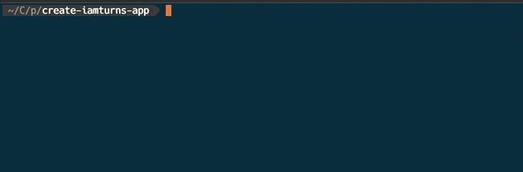
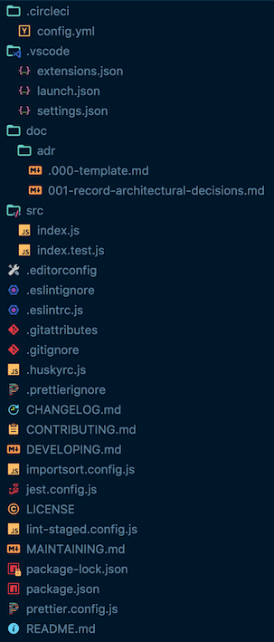

# create-iamturns-app

> App generator for my projects

```bash
npm init iamturns-app
```





- Tools configured with sensible defaults
  - [Jest](https://jestjs.io/), [ESLint](https://eslint.org/), and more
  - Optional [TypeScript](https://www.typescriptlang.org/) support
  - Nothing hidden or abstracted, easy to override and customize
- Useful `npm run` scripts
  - `test`, `lint`, `format`, `upgrade`, `reinstall`, and `reset`
  - Powered by [iamturns-scripts](https://github.com/iamturns/iamturns-scripts)
- Format (beautify) files
  - Powered by [Prettier](https://prettier.io/), [import-sort](https://github.com/renke/import-sort), [prettier-package-json](https://github.com/cameronhunter/prettier-package-json)
- CI/CD
  - Automatic validation in pull requests
  - Automatic versioning and release to NPM after merging to `master`
  - Powered by [CircleCI](https://circleci.com/) and [semantic-release](https://github.com/semantic-release/semantic-release)
- Automatically format, lint, and test changed files
  - Powered by [lint-staged](https://github.com/okonet/lint-staged), [husky](https://github.com/typicode/husky)
- Documentation templates
  - [Architectural Decision Records](https://adr.github.io/), README.md, CHANGELOG.md, DEVELOPING.md, CONTRIBUTING.md, MAINTAINING.md, LICENSE
  - Automatic table of contents generation (powered by [doctoc](https://github.com/thlorenz/doctoc))
- VS Code launch scripts and settings

## Additional Documentation

- [CHANGELOG.md](CHANGELOG.md)
- [DEVELOPING.md](DEVELOPING.md)
- [CONTRIBUTING.md](CONTRIBUTING.md)
- [MAINTAINING.md](MAINTAINING.md)

## Inspiration

- [create-react-app](https://github.com/facebook/create-react-app)
- [create-esm](https://github.com/standard-things/create-esm)
- [create-deck](https://github.com/jxnblk/mdx-deck/tree/master/create-deck)

## Credits

Authored and maintained by Matt Turnbull ([iamturns.com](https://iamturns.com) / [@iamturns](https://twitter.com/iamturns))

To all [contributors](https://github.com/iamturns/iamturns-js-toolbox/graphs/contributors) (if you exist) - thank you!

## License

Open source [licensed as MIT](https://github.com/iamturns/create-iamturns-app/blob/master/LICENSE).
