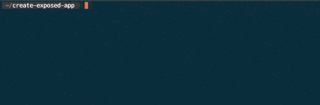
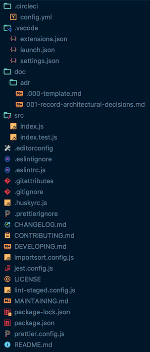

# create-exposed-app

Like zero-config? Get out!

Generate a flexible starting point for your app, where config files and scripts are in-your-face and ready to adapt to your needs.

_Because every app is unique._

Go for it:

```bash
npm init exposed-app
```





## What's included?

- :wrench: [TypeScript](https://www.typescriptlang.org/), [Babel](https://babeljs.io/), [Jest](https://jestjs.io/), [ESLint](https://eslint.org/), and more
  - Configured with sensible defaults
  - All optional and tweakable
- :arrow_forward: `npm run` scripts for `format`, `lint`, `test`, `build`, `validate`, and more
  - Inner workings exposed and tweakable
  - Automatically run on changed files
  - Powered by [nodemon](https://nodemon.io/), [lint-staged](https://github.com/okonet/lint-staged), [husky](https://github.com/typicode/husky), [onchange](https://github.com/Qard/onchange), [npm-run-all](https://github.com/mysticatea/npm-run-all), and more
- :ribbon: Format (beautify) files
  - Powered by [Prettier](https://prettier.io/), [import-sort](https://github.com/renke/import-sort), [prettier-package-json](https://github.com/cameronhunter/prettier-package-json)
- :rocket: CI/CD
  - Automatic validation in pull requests
  - Automatic versioning and release to NPM after merging to `master`
  - Powered by [CircleCI](https://circleci.com/) and [semantic-release](https://github.com/semantic-release/semantic-release)
- :book: Documentation templates
  - README.md, CHANGELOG.md, CODE_OF_CONDUCT.md, MAINTAINING.md, and LICENSE
  - [GitHub templates](https://help.github.com/articles/about-issue-and-pull-request-templates/) for pull requests, bug reports, change requests, questions, and general issues.
  - [Architectural Decision Records](https://adr.github.io/)
  - Automatic table of contents generation (powered by [doctoc](https://github.com/thlorenz/doctoc))
- :tada: More!
  - VS Code settings
  - Prevent merging of shrinkwrap files

## Usage

Run the following command and follow the prompts:

```bash
npm init exposed-app
```

You can also invoke the app with arguments. For example:

```bash
npx create-exposed-app \
  --project-package-name="my-awesome-project" \
  --project-overview="Does awesome stuff" \
  --side="server" \
  --author-name="Bruce Wayne" \
  --author-email="bruce.wayne@gmail.com" \
  --author-github="batman" \
  --author-website="https://batman.com"
```

Run `npx create-exposed-app --help` for details.

## Table of Contents

<!-- START doctoc generated TOC please keep comment here to allow auto update -->
<!-- DON'T EDIT THIS SECTION, INSTEAD RE-RUN doctoc TO UPDATE -->

- [FAQ](#faq)
  - [Uh oh, something went wrong!](#uh-oh-something-went-wrong)
  - [I wish something was different…](#i-wish-something-was-different)
  - [Can I contribute code?](#can-i-contribute-code)
  - [How do I get setup for development?](#how-do-i-get-setup-for-development)
  - [What's the development workflow?](#whats-the-development-workflow)
  - [Why are the dev tools scripts so verbose?](#why-are-the-dev-tools-scripts-so-verbose)
  - [Why are there so many config files?](#why-are-there-so-many-config-files)
  - [Why isn't the build bundled or minified?](#why-isnt-the-build-bundled-or-minified)
  - [Why do my files automatically change?](#why-do-my-files-automatically-change)
  - [Why does the Babel build script contain the `--source-maps` option?](#why-does-the-babel-build-script-contain-the---source-maps-option)
  - [Why does the `format:eslint` script ignore errors?](#why-does-the-formateslint-script-ignore-errors)
  - [My question isn't answered…](#my-question-isnt-answered)
- [Inspiration](#inspiration)
- [Credits](#credits)
- [License](#license)

<!-- END doctoc generated TOC please keep comment here to allow auto update -->

## FAQ

### Uh oh, something went wrong!

Sorry about that. Please submit a bug report using the [GitHub issue tracker](https://github.com/iamturns/create-exposed-app/issues).

### I wish something was different…

Keen to hear all ideas! Create an enhancement request using the [GitHub issue tracker](https://github.com/iamturns/create-exposed-app/issues).

### Can I contribute code?

Yes please!

> First time contributing code to an open source project on GitHub? Check out this [free video tutorial](https://egghead.io/courses/how-to-contribute-to-an-open-source-project-on-github).

### How do I get setup for development?

1. If you don't have write access to this repo, [fork it](https://github.com/iamturns/create-exposed-app/fork).
1. Clone the repo.
1. Install dependencies: `npm install`
1. Ensure everything is working: `npm run validate`

### What's the development workflow?

1. Create a new git branch
1. Create a system-wide link for use in other directories: `npm link`
1. `npm run dev`
1. Write code
1. Create new temporary directory to test app population named `create-exposed-app-test-my-new-feature`
1. Run `npm init exposed-app` or `npx create-exposed-app` in `create-exposed-app-test-my-new-feature` directory

   Note: It should use the system-wide local link to your project

1. Commit changes to your branch
1. Push changes to GitHub
1. Submit a [pull request on GitHub](https://github.com/iamturns/create-exposed-app/pulls)

Once complete:

1. Remove the system-wide link: `npm unlink`
1. Remove the temporary test directory `create-exposed-app-test-my-new-feature`

### Why are the dev tools scripts so verbose?

See [ADR-002: Prefer Configurable Dev Tools](docs/adr/002-prefer-configurable-dev-tools.md).

### Why are there so many config files?

See [ADR-003: Prefer Multiple Config Files](docs/adr/003-prefer-multiple-config-files.md).

### Why isn't the build bundled or minified?

See [ADR-004: Minimally Transform Source Code During Build](docs/adr/004-minimally-transform-source-code-during-build.md).

### Why do my files automatically change?

Files are automatically formatted. See [ADR-005: Format Files](docs/adr/005-format-files.md) and [ADR-006: Format Files Programmatically](docs/adr/006-format-files-programmatically.md).

### Why does the Babel build script contain the `--source-maps` option?

This option is available in the Babel config file (`sourceMaps: true`), but has diffrent behaviour. Only the command line supports the creation of `.map` files. See [https://github.com/babel/babel/issues/5261](https://github.com/babel/babel/issues/5261).

### Why does the `format:eslint` script ignore errors?

Linting errors should not be reported when formatting, that it was the `lint` command is for.

Errors are ignored by appending the following: `>/dev/null 2>&1 || true`.

### My question isn't answered…

Ask away using the [GitHub issue tracker](https://github.com/iamturns/create-exposed-app/issues).

## Inspiration

- [create-react-app](https://github.com/facebook/create-react-app)
- [create-esm](https://github.com/standard-things/create-esm)
- [create-deck](https://github.com/jxnblk/mdx-deck/tree/master/create-deck)

## Credits

Authored and maintained by Matt Turnbull ([iamturns.com](https://iamturns.com) / [@iamturns](https://twitter.com/iamturns))

To all [contributors](https://github.com/iamturns/create-exposed-app/graphs/contributors) (if you exist) - thank you!

## License

Open source [licensed as MIT](https://github.com/iamturns/create-exposed-app/blob/master/LICENSE).
